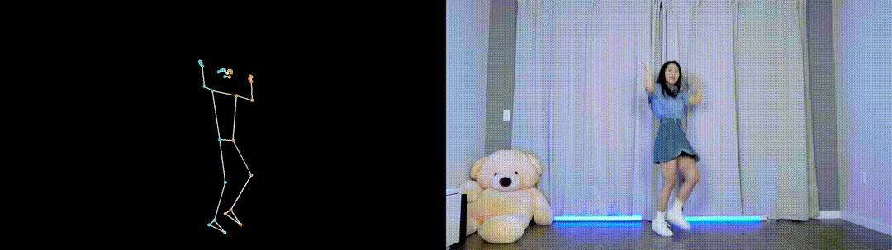
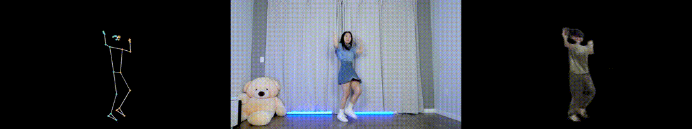

# Yang Yang Dance Simulator
GDSC 2024 - AI Team Project

## Dataset
### Training Data
we first extract the raw video into 2 domains:
- domainA: the pose skeleton of the dancer
- domainB: the dancer's image frame with background removed

### Testing Data
We only need the domainA data.

At Testing phase, we only need to extract the pose skeleton of the dancer from the video. However, we also provide the original image frame and concatenate it with the extracted pose skeleton for better visualization.

## Model
We use Pix2Pix GAN model to train the data. The model is trained on the training data and tested on the testing data.
### Training
### Testing

## Contributors
- Chen-Yang Yu