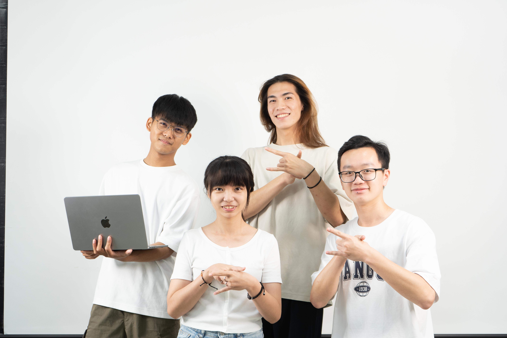

# Yang Yang Dance Simulator
GDSC 2024 - AI Team Project

## Introduciton
Our project aims to make dance EASY!

Initially, we employ the Pose Estimation model (MediaPipe) to extract the pose skeleton from the dancer's video. Following this, we use the Rembg model to eliminate the background from the dancer's image frame.

In the final step, we leverage the Pix2Pix and Pix2PixHD models to train a conditional GAN model. This model is capable of generating a dance video that corresponds to the pose skeleton.

## Dataset
### Training Data
We first extract the raw video into 2 domains:
- domainA: the pose skeleton of the dancer
- domainB: the dancer's image frame with background removed

### Testing Data
For preparing testing data, we only need to extract the pose skeleton(domainA) of the dancer from the video.

## Model Structure and Pipeline
We utilize Pix2Pix and Pix2PixHD GAN model to train the data and generate the target domain from the source domain.
### Training Phase

### Testing Phase

## Results
We first pick the video from [ILLIT (아일릿) ‘Magnetic’ Lisa Rhee Dance Cover](https://youtu.be/fcOXwMh3zn4)

Then, we show the inferenced results from the Pix2Pix and Pix2PixHD model. 

Dance → Extracted Pose → Fish (Author: Chen-Yang Yu)

### Pix2Pix

### Pix2PixHD

## Contributors
- Chen-Yang Yu (Leader)
- Yu-Chen Yen
- Yu-Hao Chiang
- Chu-Yu Wu

## References
- rembg: https://github.com/danielgatis/rembg
- mediapipe: https://github.com/google-ai-edge/mediapipe
- pix2pix: https://github.com/junyanz/pytorch-CycleGAN-and-pix2pix
- pix2pixHD: https://github.com/NVIDIA/pix2pixHD