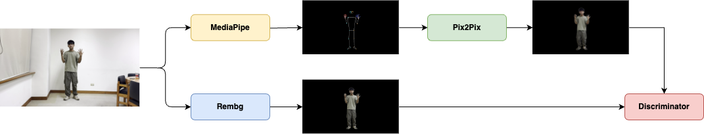

# Yang Yang Dance Simulator
GDSC 2024 - AI Team Project

## Introduciton

## Dataset
### Training Data
We first extract the raw video into 2 domains:
- domainA: the pose skeleton of the dancer
- domainB: the dancer's image frame with background removed

### Testing Data
For preparing testing data, we only need to extract the pose skeleton(domainA) of the dancer from the video.

## Model Structure and Pipeline
We utilize Pix2Pix GAN model to train the data and generate the target domain from the source domain.
### Training Phase

### Testing Phase

## Results
- Dance → Pose → Fish(Author: Chen-Yang Yu)

## Contributors
- Chen-Yang Yu